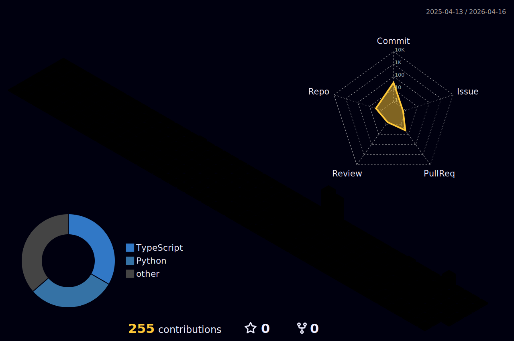

# Hi there, I'm Raahym

Welcome to my GitHub profile! I'm a second-year BSc Computer Science student at University College London (UCL), passionate about problem-solving, artificial intelligence, and machine learning.

## About Me
-  Currently studying **Computer Science** at **UCL**
-  Interested in **AI**, **Machine Learning**, **Robotics**, and **Mathematics**
-  Always looking for innovative ways to solve problems with code
-  I enjoy working on **projects related to algorithms**, **simulation**, and **data science**
-  Constantly learning and improving my skills

Check out the repositories below for more details!

##  How to reach me
-  Email: raahym.rehan@gmail.com
-  LinkedIn: https://www.linkedin.com/in/raahymrehan

Feel free to check out my projects, fork them, or contribute. Let's collaborate and create something awesome! 🚀

  

<!---
raahymrehan0/raahymrehan0 is a ✨ special ✨ repository because its `README.md` (this file) appears on your GitHub profile.
You can click the Preview link to take a look at your changes.
--->
